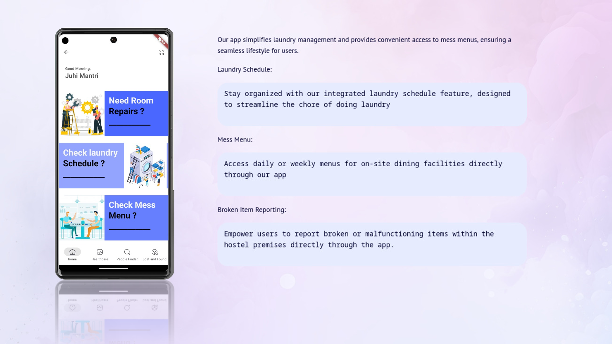

# VIT Connect+

#### This app has a suite of features designed to address several key issues faced by students on campus/hostel, from digitalizing healthcentre, facilitating carpool coordination, efficient management of lost and found, roommate searching system, digitalizing repair and maintainance in hostels to displaying hostel necessities like laundry schedule and mess menu

